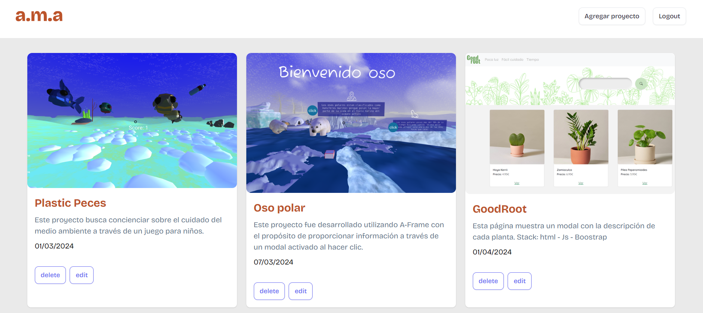
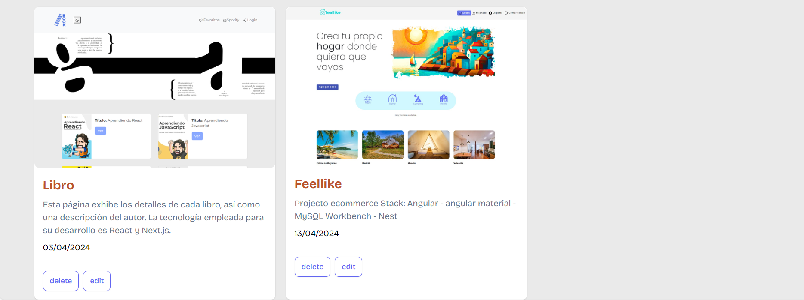
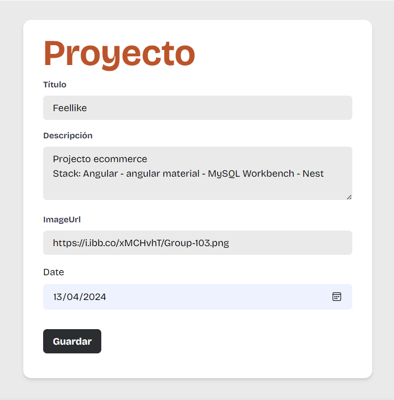
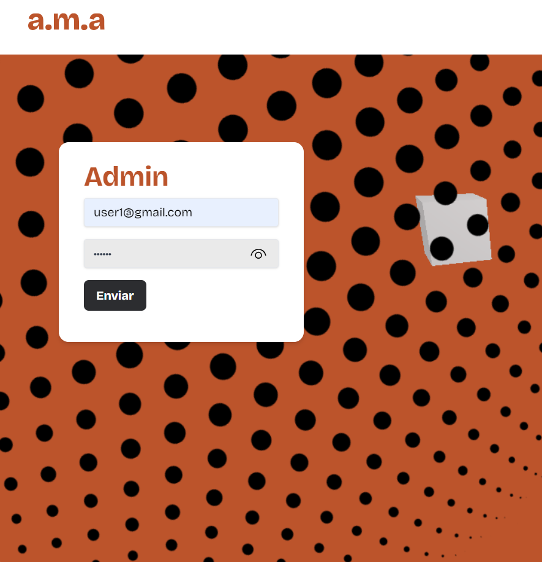

# FRONT-END
## Ejecutar
npm run dev

## Instalacion
npm create vite@latest

## ruteo
npm i react-router-dom

## Test
npm install -D vitest
npm i -D jsdom @testing-library/react
Añadir en package.json "test": "vitest" y ejecutar npm run test

## Tailwind

- npm install -D tailwindcss postcss autoprefixer
- npx tailwindcss init -p
- y lo añades en index.css:
@tailwind base;
@tailwind components;
@tailwind utilities;
- Ejemplo de componentes: https://tailwindcomponents.com/component/search-input

## instalacion
npm install react-hook-form
npm i axios
npm i js-cookie
npm install dayjs

# instalacion three.js
npm install three
npm install three stats.js

# Imagenes

### Registrado como admin

### Editar CRUD

### Usuario registrado (token)

### Por completar
- Definir roles
- Visualización para los visitantes